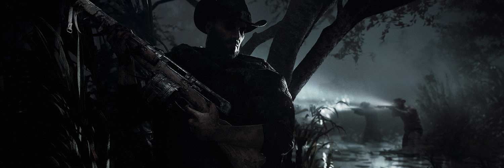
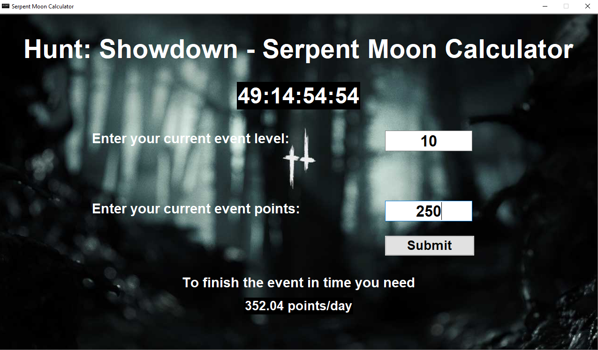

 

`SerpentMoonGUI` is an easy way to track your progress in the ongoing Hunt: Showdown Serpent Moon Event.

The goal of this project is to get an easy-to-use application to track your current progress in the event.

All of this project is a work-in-progress and subject to change.

Constructive criticism and contributions are well appreciated.

**Table of Contents**
---
+ [Key Features](#key-features)
+ [Usage](#usage)
+ [Installation Options](#installation-options)
+ [How to contribute](#how-to-contribute)
+ [License](#license)
+ [Donations](#donations)

**Key Features**
---
+ keep track of your points/day average
+ have a nifty timer ticking down to pressure you

Currently only tested on Windows 10.

**Usage**
---

```
Enter values for 'current event level' [the level displayed on the event screen menu]
and 'current event points' [the progress you made in the current bracket].
Click on the `Submit`-Button and the text below will update according to your input
```



**Installation Options**
---

1. Clone this repository.
    + `cd ~/your/project/path`
    + `git clone https://github.com/fchehade/SerpentMoonGUI.git`

2. Change directory `cd` to the SerpentMoonGUI root directory.
3. Create a virtual environment and install requirements.txt
    + `python3 -m venv venv`
    + `venv/Scripts/activate`
    + `pip install requirements.txt`
4. Run the `main.py` file in the SerpentMoonGUI directory.

**How to Contribute**
---

1. Clone repo and create a new branch: `$ git checkout https://github.com/fchehade/SerpentMoonGUI -b name_for_new_branch`.
2. Make changes and test
3. Submit Pull Request with comprehensive description of changes

**License**
---
This project is licensed under [MIT](LICENSE)

**Donations**
---

This is free, open-source software. If you'd like to support the development of future projects, or say thanks for this one, you can donate at [Paypal](https://www.paypal.me/decalift) or [buy me a coffee](https://www.buymeacoffee.com/decalift).

<a href="https://www.paypal.me/decalift"></a>&nbsp; &nbsp; <a href="https://www.buymeacoffee.com/decalift" target="_blank"></a>